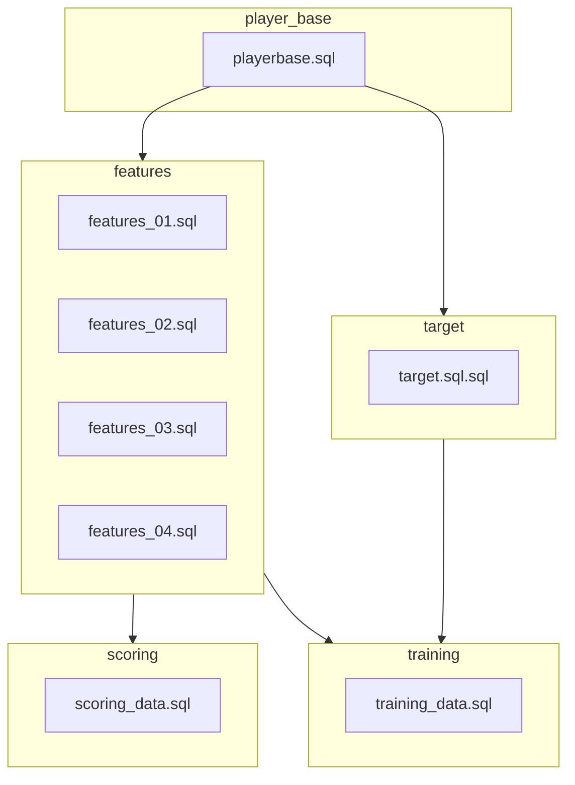
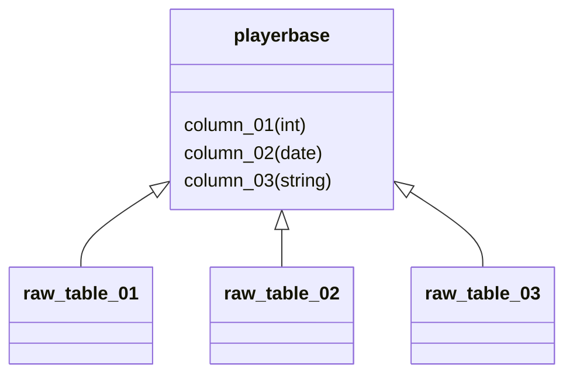
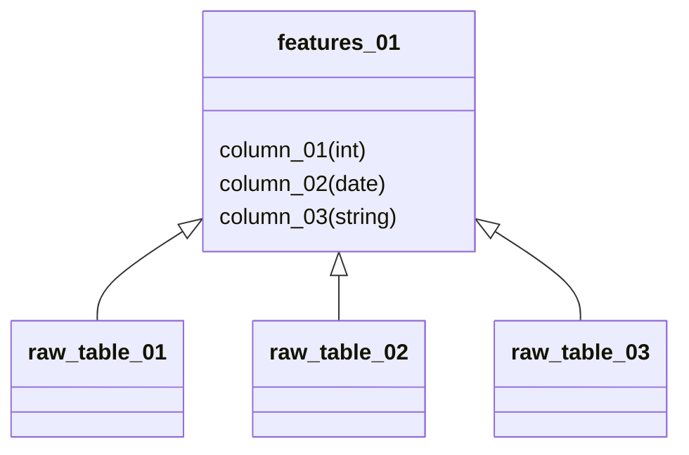
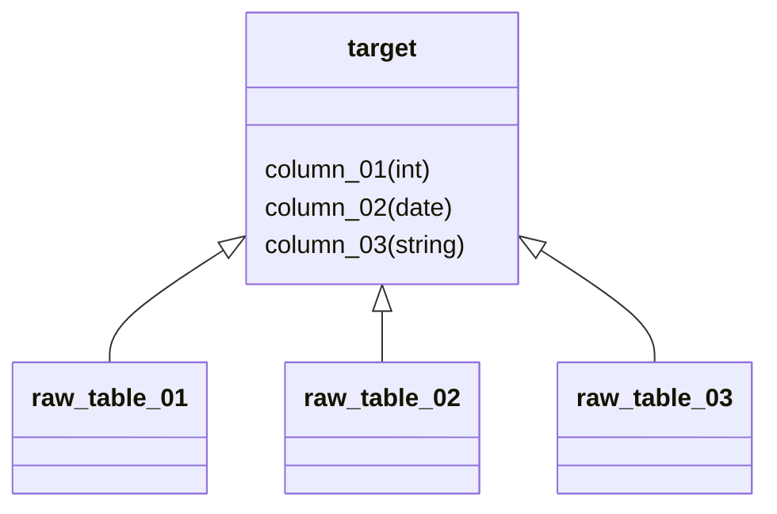
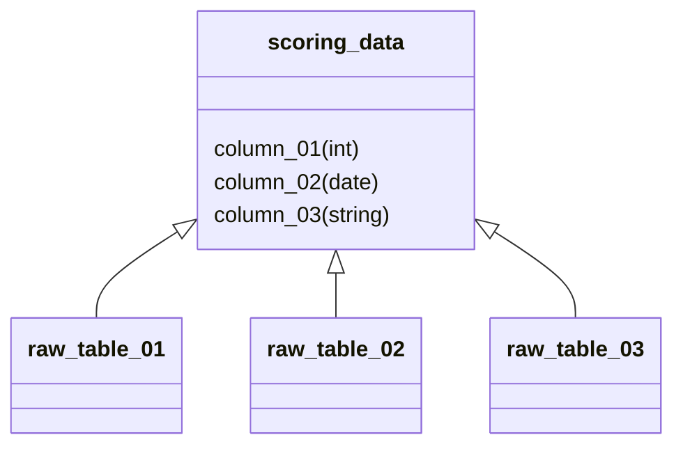
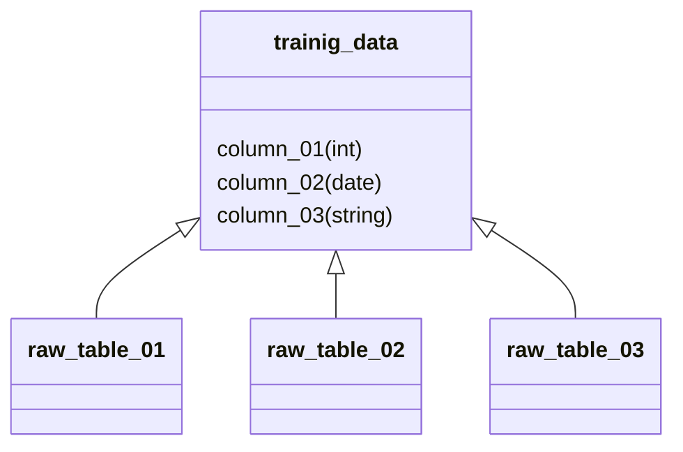

# SQL pipeline documentation
- [SQL pipeline documentation](#sql-pipeline-documentation)
  - [Introduction](#introduction)
  - [Mermaid](#mermaid)
  - [Execution sequence - Creating training and scoring data](#execution-sequence---creating-training-and-scoring-data)
  - [Table illustrations](#table-illustrations)
  - [Table illustration - playerbase](#table-illustration---playerbase)
  - [Table illustration - features\_01](#table-illustration---features_01)
  - [Table illustration - features\_02](#table-illustration---features_02)
  - [Table illustration - features\_03](#table-illustration---features_03)
  - [Table illustration - features\_04](#table-illustration---features_04)
  - [Table illustration - target](#table-illustration---target)
  - [Table illustration - scoring\_data](#table-illustration---scoring_data)
  - [Table illustration - trainig\_data](#table-illustration---trainig_data)

## Introduction
Documenting SQL scripts, execution sequences and resulting tables is important. This markdown file can be used as a template.

## Mermaid
Mermaid is a java script library for creating diagrams and flowcharts.

There are a number of extensions in VSC available to help create, view and export markdown files using Mermaid language:
- [Extension 1](https://marketplace.visualstudio.com/items?itemName=bierner.markdown-mermaid)
- [Extension 2](https://marketplace.visualstudio.com/items?itemName=tomoyukim.vscode-mermaid-editor)
- [Extension 3](https://marketplace.visualstudio.com/items?itemName=Gruntfuggly.mermaid-export)
- [Extension 4](https://marketplace.visualstudio.com/items?itemName=bpruitt-goddard.mermaid-markdown-syntax-highlighting )

For more details 

## Execution sequence - Creating training and scoring data
There is a crossover between the scripts used by the training and scoring DAGs.

## Table illustrations
|SQL filename|Output table|Author|Table summary|Primary key|
|-|-|-|-|-|
|playerbase.sql|playerbase|x|x|x|
|features_01.sql|features_01|x|x|x|
|features_02.sql|features_02|x|x|x|
|features_03.sql|features_03|x|x|x|
|features_04.sql|features_04|x|x|x|
|training_data.sql|training_data|x|x|x|
|scoring_data.sql|scoring_data|x|x|x|

## Table illustration - playerbase

## Table illustration - features_01

## Table illustration - features_02

## Table illustration - features_03

## Table illustration - features_04

## Table illustration - target

## Table illustration - scoring_data

## Table illustration - trainig_data
