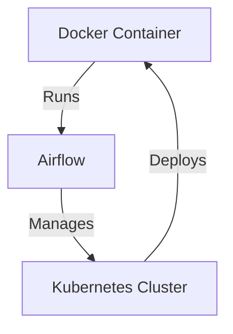

Contents
==
- [Contents](#contents)
- [Docker, Airflow, Kubernetes](#docker-airflow-kubernetes)
- [How do they fit together?](#how-do-they-fit-together)

<!--intro-start-->
# Docker, Airflow, Kubernetes
**Docker** Docker is a platform designed to make it easier to create, deploy, and run applications by using containers.

**Airflow** is an open-source orchestration tool used to programmatically author, schedule, and monitor workflows.

**Kubernetes** is open-source system for automating deployment, scaling, and management of containerized applications.

# How do they fit together?

- Docker allows you to package your application and its dependencies into containers, making it easy to deploy and run anywhere.
- Airflow helps you define and manage complex workflows, orchestrating tasks and dependencies.
- Kubernetes provides the infrastructure for running and scaling your Docker containers, ensuring they're deployed efficiently and reliably across a cluster of machines.
  

<!--intro-end-->
